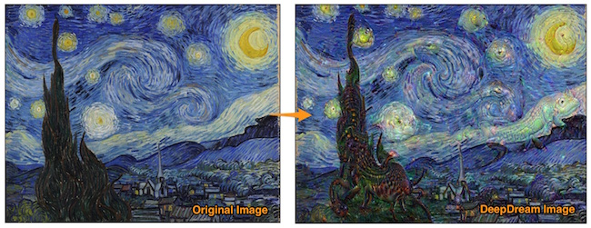
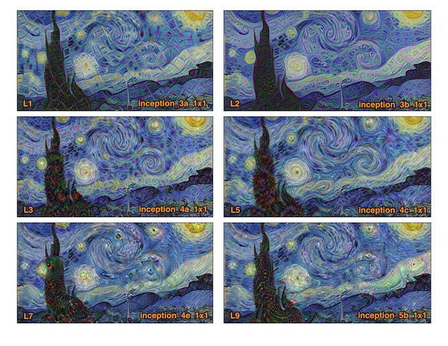

# PyDeepDream

Deep Dream is an algorithm that makes an pattern detection algorithm over-interpret patterns. The Deep Dream algorithm is a modified neural network. Instead of identifying objects in an input image, it changes the image into the direction of its training data set, which produces impressive surrealistic, dream-like images.
(read the original Google blog <https://research.googleblog.com/2015/06/inceptionism-going-deeper-into-neural.html>)

The result are beautiful hallucinations like the one below. The neural network amplified the perceived objects that it is being trained to recognized.



*Figure. Vangogh's "Starry Night" Deep Dream transformation*

See the full installation instructions (for Windows 10) on Blog post at:

<http://bennycheung.github.io/deep-dream-on-windows-10>

## Deep Dream Python Script
Deep Dream Wiki: <https://en.wikipedia.org/wiki/DeepDream>

### Install Deep Dream Script
You can find the original code at GitHub repository:
<https://github.com/google/deepdream/blob/master/dream.ipynb>

```bash
git clone https://github.com/PyDeepDream
```

Then install of the Deep Dream script's dependencies from `requirements.txt` list

```bash
conda install --yes --file requirements.txt
```

```bash
cd PyDeepDream
python deepdream.py --help
```

Install the GoogLeNet Caffe pre-trained model

```bash
cd PyDeepDream
mkdir bvlc_googlenet
cd bvlc_googlenet
```

download from <http://dl.caffe.berkeleyvision.org/bvlc_googlenet.caffemodel>
(~54 MB)
and save the model here at `bvlc_googlenet/bvlc_googlenet.caffemodel`. The
`deepdream.py` assumes it can find the model there.

#### How to Use
Use `-i` to specify your input content image. It will deep dream at a random layer.

```bash
python deepdream.py -i {your_image}.jpg
```

If you want to start Deep Dream at a layer depth, type and octave manually:

```bash
python deepdream.py -d 1 -t 1 -o 6 -i Style_StarryNight.jpg
```

#### Running All Layers Experiment
We are using `-d` to define which layer that we shall perform the Deep Dream. The level number will be mapped to a GoogLeNet layer name.

```bash
# Level 1 - inception_3a_1x1
python deepdream.py -d 1 -t 1 -o 6 -i Style_StarryNight.jpg

# Level 2 - inception_3b_1x1
python deepdream.py -d 2 -t 1 -o 6 -i Style_StarryNight.jpg

# Level 3 - inception_4a_1x1
python deepdream.py -d 3 -t 1 -o 6 -i Style_StarryNight.jpg

# Level 5 - inception_4c_1x1
python deepdream.py -d 5 -t 1 -o 6 -i Style_StarryNight.jpg

# Level 7 - inception_4e_1x1
python deepdream.py -d 7 -t 1 -o 6 -i Style_StarryNight.jpg

# Level 9 - inception_5b_1x1
python deepdream.py -d 9 -t 1 -o 6 -i Style_StarryNight.jpg
```

The output dream images are stored with the original photo and tagged with a inception layer name. For example, `Style_StarryNight.jpg` with `-d 1` will produce the Deep Dream result `Style_StrarryNight_inception_3a_1x1_dream.jpg`.

Here are the images of the Deep Dreaming,



*Figure. Deep Dream results from the inception into different levels of the neural network. Lower levels amplify the NN patterns. Higher levels amplify the NN objects*

